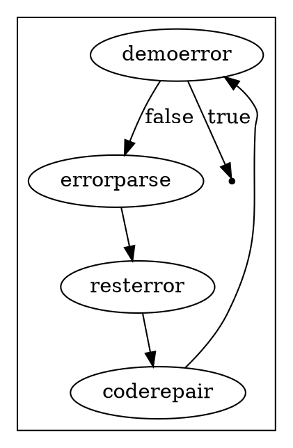

```dot
digraph functionCall { 
    subgraph cluster1 
    { 
        A[label=demoerror]; 
        B[label=errorparse]; 
        C[label=resterror]; 
        D[label=coderepair];

        X[shape=point];

        A->B[label=false];
        B->C;
        C->D;
        D->A
        
        A->X[label=true];    
    }   
}
```